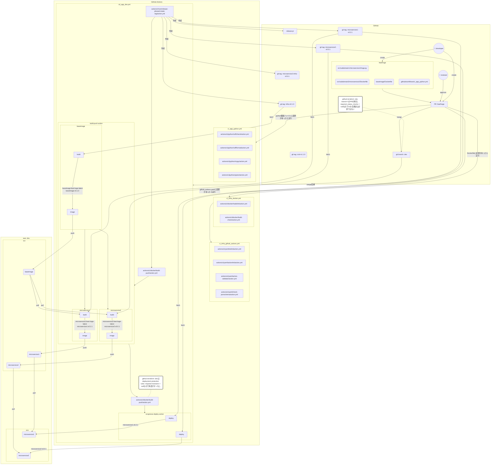
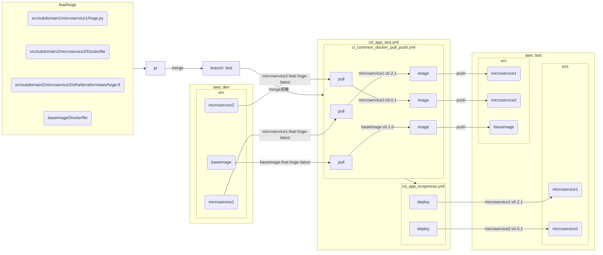
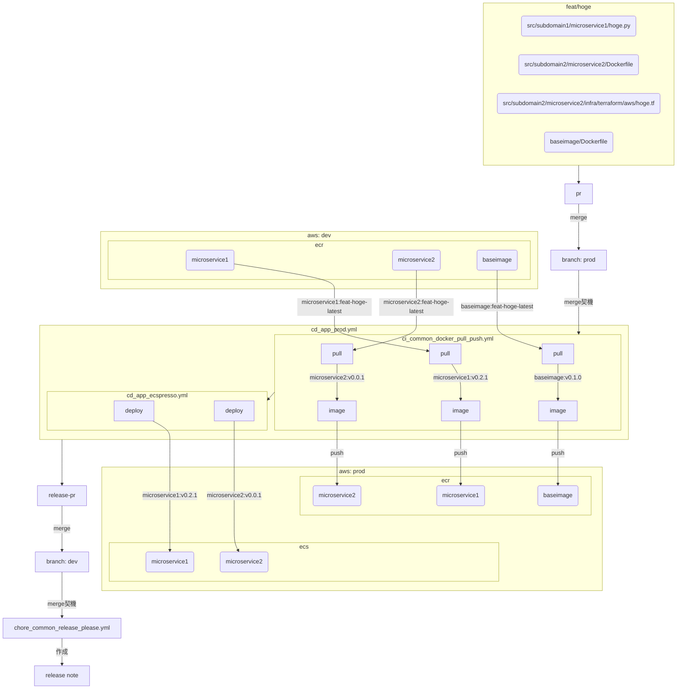

# CI/CD実装方針・リリース管理方式設計

## 概要

- 目的：`xev-vpp`共通のCI/CD実装方針とリリース管理方式を設計し、効率的な開発とリリースを実現すること
- 短期目標：少なくとも`xev-vpp`内の`evems-per-vehicle`に向けて設計を行う
- 中期目標：`xev-vpp`内の`evems-per-vehicle`、`evems-vehicle-group`、`doms-for-drivers`で共通のリリース管理方式、CI/CD実装を目指すこととする

## 実装メモ

- docker image tagは`@`や`/`といった特殊文字は使用出来ない為使用しない
- git tagには`@`や`/`は含む事は可能であるが、git内で`@`は特殊な意味を持ち、`/`はブランチ名と混合を避けるためそのどちらも使用しない
- ブランチ名をimage tagに含める場合、`/`は`-`に置換する
- image tag名は128文字制限があるため、128文字以降は切り捨てる

## 用語集

- `microservice`: 個別のマイクロサービスを指す。e.g. `src/*/*`でディレクトリ一覧が取得した場合の各ディレクトリ、等
- `per-microservice-module(microservice-module)`: 便宜上マイクロサービス固有のインフラを指す事とする
- `per-repository-module(repository-module)`: 便宜上マイクロサービス共通のインフラを指す事とする
  - e.g. マイクロサービス共通baseimage用のECR用terraform、baseimage用Dockerfile
- `release-please`: google製のGitHub releaseとSemVerの自動繰り上げを行なってくれるツール
- `component`: release-pleaseが指すリリース対象のこと。microservice, microservice-module, repository-module, cicdのいずれかが該当する
- `releasable unit`: release-pleaseが指すリリース可能な資材のこと。設定系ファイル等は含まれず、あくまでMVPを動かす上で必要な資材のみを指す
- `release pr`: release-pleaseが作成するPRのこと。CHANGELOG.mdの更新等を行なってくれる。GitHub releaseの作成のタイミングは設定が可能
- `genmatrixpy`: 変更があったcomponentを後続の処理で使う形式で出力する自前実装のpythonスクリプト`generate_github_actions_strategy_matrix.py`のこと
  - rational（common scripts）: ほぼすべてのCI/CDで使用され、かつ本番環境への影響が大きいためunit testの書きやすいpythonで実装する
- `dev|test|stg|prod`: 以下のそれぞれのAWS環境と対応しているメインブランチ群を指すこととする
- `dev環境|test環境|stg環境|prod環境`: deploy先のAWS環境群を指すこととする
- `image tag`: docker imageに付与するタグのこと。git tagより命名の制約が多いため、git tagはimage tagに寄せることとする
- `git tag`: git上で作成するタグのこと。git tagとimage tagは1対多の関係とする
- `GitHub Actions context(github_actions context)`: GitHub Actionsの実行時に参照できる情報。e.g. workflow_dispatchでの実行の場合、実行ブランチ名などが含まれる

## ユースケース

- 前提:
  - アプリのリリースはGitFeatureFlowを前提としているが、GitFlowに近い方式にも対応させる
  - インフラのリリースはGitFlowを前提としているが、GitFeatureFlowに近い方式にも対応させる
    - rational(branching model): GitFeatureFlowはインフラリリースに向いていないため

### build/push: flowchart

- マージ契機で`actions/chore/release-please/create-tag/action.yml`が実行される
  - `googleapis/release-please-action`を以下の設定で実行する
    - `skip-github-release: true`
    - `skip-github-pull-request: false`
    - 結果: git tag群のみ作成される
      - 当てはまる条件の各componentのgit tagをそれぞれ作成する:
        - `microservice`: `${MICROSERVICE_NAME}-v${SEMVER}`
        - `microservice-module`: `${MICROSERVICE_NAME}-infra-v${SEMVER}`
        - `repository-module`: `infra-v${SEMVER}`
        - `cicd`: `cicd-v${SEMVER}`
          - rational（git tag命名規則）: 切り戻しを行ったり、原因不明のバグがあった場合の調査の容易さを考慮してcomponentごとにバージョンを付与する
- pathsにインフラ資材が含まれる場合、`cd_infra_terragrunt`が実行される
  - rational(depends on): ECR初回デプロイなどの順番を考慮して、必ずアプリの前にインフラをデプロイする
- pathsにreleasable unitがひとつでもあれば`actions/ci/docker/build-push/action.yml`が実行される
  - genmatrixpyで変更があったcomponentの内容から処理を分岐する
    - ※baseimageは必ず先にbuild pushされる
    - `repository-module`に`**ecr*/*`、`baseimage/*`が含まれる場合:
      - releasable unitsありと判定し、以下のimage tagを付与してdev環境のECRレポジトリ`共通ECRレポジトリ名(e.g. evems-baseimage)`へbuild pushする
        - `v${SEMVER}`
        - `v${MAJOR}`
        - `v${MAJOR}.${MINOR}`
        - `${SHA_LONG}`
        - `${SHA_SHORT}`
        - `sha-${SHA_LONG}`
        - `sha-${SHA_SHORT}`
        - `YYMMDD`
        - `YYMMDDHHMM`
        - `${BRANCH_NAME}`
        - `${BRANCH_NAME}-latest`
        - `latest`
    - `microservice`に`.py`、`!**/test**`、`Dockerfile`、`*requirements*.txt`が含まれる場合:
      - releasable unitsありと判定し、以下のimage tagを付与してdev環境のECRレポジトリ`microservice`へbuild pushする
        - `v${SEMVER}`
        - `v${MAJOR}`
        - `v${MAJOR}.${MINOR}`
        - `${SHA_LONG}`
        - `${SHA_SHORT}`
        - `sha-${SHA_LONG}`
        - `sha-${SHA_SHORT}`
        - `YYMMDD`
        - `YYMMDDHHMM`
        - `${BRANCH_NAME}`
        - `${BRANCH_NAME}-latest`
        - `latest`
          - rational（image tag命名規則）: 後続の処理で必要となる。また、原因不明のバグの究明に役に立ったり後々の自動化で役に立つ可能性がある為、一般的なパターンをなるべく網羅する
    - ※以下は「まだ準備が完璧でないマイクロサービス」「新規マイクロサービス」を取り扱う際にあった方が良い処理
    - TBD/DO_LATER: `microservice`にreleasable unitsが存在しないが、`microservice-module`に`**ecr*/*`が含まれる場合:
      - rational: variables.tfなどの変更も検知するためにecrという文字列を含むディレクトリ配下すべてを対象とする
      - TBD/DO_LATER: `${BRANCH_NAME}-latest`をpull pushする
        - TBD/DO_LATER: pull出来ない場合は上記の分岐でbuild pushをする
          - TBD/DO_LATER: それも出来ない場合は何もしない
- そのまま続けて`cd_app_ecspresso.yml`が実行される
  - `microservice`に`.py`、`!**/test**`、`Dockerfile`、`*requirements*.txt`が含まれる場合:
    - 以下のimage tagを指定してdev環境のECSにデプロイする
      - `v${SEMVER}`
  - TBD/DO_LATER: `microservice`にreleasable unitsが存在しないが、`microservice-module`に`**ecr*/*`が含まれる場合:
    - 個別の`microservice`を`v${SEMVER}`で再デプロイを試みる
  - TBD/DO_LATER: `repository-module`に`**ecr*/*`、`baseimage/*`が含まれる場合:
    - すべての`microservice`を`v${SEMVER}`で再デプロイを試みる

### branch/deployment protection rules

- dev/testへのPRの場合
  - 最低でも一人のReview Approvalが無ければマージ不可
  - CIの全通過は任意
    - rulesetsでCIの全通過を必須にした場合、発動しなかったCIのstatusを待ち続ける事になるためdevへは設定しない
      - e.g. pythonの変更しかしていないのでpythonのCIのみが発動したが、terraformのCIが通過していない為PRがマージ出来ない状態、等
- ConventionalCommit以外のコミットが入っている場合、マージ不可
- stg/prodへのPRの場合
  - 最低でも二人のReview Approvalが無ければマージ不可
  - CIの全通過は必須
  - deploymentが作成されるjobはReviewerからの承認ボタンのクリックが必要

### feature branch -> testへのmerge

- devにマージされ、build pushがすでに実施されている前提。TBD/DO_LATER: GitHubのdeployment機能で強制させる
- pathsにインフラ資材が含まれる場合、`cd_infra_terragrunt`が実行される
- pathsにreleasable unitがひとつでもあれば`ci_common_docker_pull_push.yml`が実行される
  - `microservice`に`.py`、`!**/test**`、`Dockerfile`、`*requirements*.txt`が含まれる場合:
    - 以下のimage tagでdev環境のECRレポジトリ`microservice`からpullする
      - `${BRANCH_NAME}-latest`
        - rational（image tag指定）: 同じブランチの最新でさえあれば良く、github_actions contextの情報だけで指定が可能なため
    - pullした後はdevのECRから同じimageに紐付いているタグ一覧を取得し、以下のimage tag（devと同一）でtest環境のECRレポジトリ`microservice`へpushする
      - `v${SEMVER}`
      - `v${MAJOR}`
      - `v${MAJOR}.${MINOR}`
      - `${SHA_LONG}`
      - `${SHA_SHORT}`
      - `sha-${SHA_LONG}`
      - `sha-${SHA_SHORT}`
      - `YYMMDD`
      - `YYMMDDHHMM`
      - `${BRANCH_NAME}`
      - `${BRANCH_NAME}-latest`
      - `latest`
  - TBD/DO_LATER: `microservice`にreleasable unitsが存在しないが、`microservice-module`に`**ecr*/*`が含まれる場合:
    - TBD/DO_LATER: `${BRANCH_NAME}-latest`をpull pushする
      - TBD/DO_LATER: pull出来ない場合は上記の分岐でbuild pushをする
        - TBD/DO_LATER: それも出来ない場合は何もしない
  - `repository-module`に`**ecr*/*`、`baseimage/*`が含まれる場合:
    - 以下のimage tagでdev環境のECRレポジトリ`共通ECRレポジトリ名(e.g. evems-baseimage)`からpullする
      - `infra${BRANCH_NAME}-latest`
    - pullした後はdevのECRからタグ一覧を取得し、test環境のECRレポジトリ`共通ECRレポジトリ名(e.g. evems-baseimage)`へまとめてpushする
- そのまま続けて`cd_app_ecspresso.yml`が実行される
  - `microservice`に`.py`、`!**/test**`、`Dockerfile`、`*requirements*.txt`が含まれる場合:
    - 以下のimage tagを指定してdev環境のECSにデプロイする
      - `v${SEMVER}`
  - TBD/DO_LATER: `microservice`にreleasable unitsが存在しないが、`microservice-module`に`**ecr*/*`が含まれる場合:
    - 個別の`microservice`を`v${SEMVER}`で再デプロイを試みる
  - TBD/DO_LATER: `repository-module`に`**ecr*/*`、`baseimage/*`が含まれる場合:
    - すべての`microservice`を`v${SEMVER}`で再デプロイを試みる

### feature branch -> stgへのmerge

- testにマージされ、build pushがすでに実施されている前提
- testへのmergeの処理と同様に、devからstgへのpull push, deployを行う

### feature branch -> prodへのmerge

- GitFeatureFlowなので、feature branch1つ毎のリリースを前提とする
  - 初回デプロイや、GitFeatureFlowを崩してのリリースをせざるを得ない状況でのGitFlowリリースにも対応する必要がある
- feature branchひとつの場合:
  - feature branch -> prodへのmerge: # testにマージされ、build pushがすでに実施されている前提
    - testへのmergeの処理と同様に、devからprodへのpull push, deployを行う
- 複数のfeature branchの場合:
  - devをrelease branch扱いにし、dev -> prodのmergeを行う
    - 別途release/* branchを作成する場合も同様
  - 変更があった各マイクロサービスの`latest`をpull pushする
    - 紐付く`v${SEMVER}`を特定し、prod環境のECRレポジトリ`microservice`へpushする
- そのまま続けて`cd_app_ecspresso.yml`が実行される
  - `microservice`に`.py`、`!**/test**`、`Dockerfile`、`*requirements*.txt`が含まれる場合:
    - 以下のimage tagを指定してdev環境のECSにデプロイする
      - `v${SEMVER}`
  - TBD/DO_LATER: `microservice`にreleasable unitsが存在しないが、`microservice-module`に`**ecr*/*`が含まれる場合:
    - 個別の`microservice`を`v${SEMVER}`で再デプロイを試みる
  - TBD/DO_LATER: `repository-module`に`**ecr*/*`、`baseimage/*`が含まれる場合:
    - すべての`microservice`を`v${SEMVER}`で再デプロイを試みる
- デプロイが完了したら`chore_common_release_tag_only.yml`で作成されたrelease prをマージさせる
- マージ契機で`chore_common_release.yml`を実行する
  - `googleapis/release-please-action`を以下の設定で実行する
    - `skip-github-release: false`
    - `skip-github-pull-request: false`
  - github releaseがdraft作成されるので、必要に応じて手動で編集して公開する

### workflow_dispatchでの実行の場合

- 以下のworkflowはCI/CDの動作確認など、必要に応じて好きな順番で個別に実行する
  - `actions/chore/release-please/create-tag/action.yml`
  - `actions/ci/docker/build-push/action.yml`
  - `ci_common_docker_pull_push.yml`
  - `cd_infra_terragrunt.yml`
  - `cd_app_ecspresso.yml`
  - `chore_common_release_please.yml`
- TODO: 手動実行の場合のフローを記載する。SEMVERは指定せず、branch-latestのみで完結する様にする

### TODO: 承認プロセス

